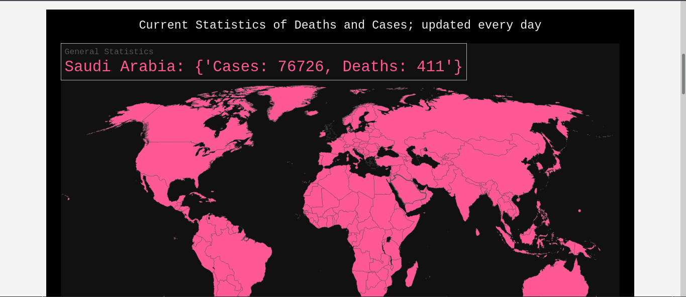
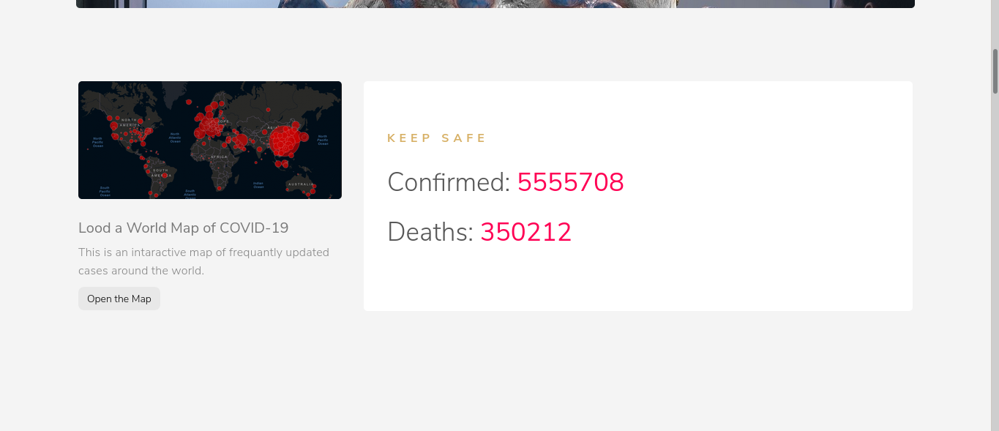
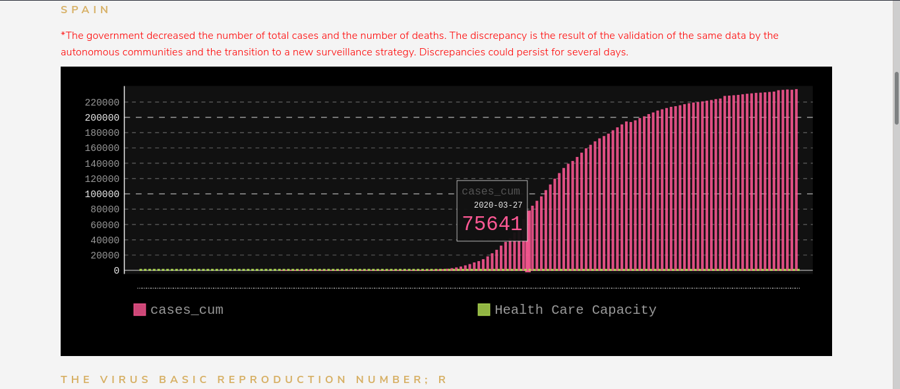
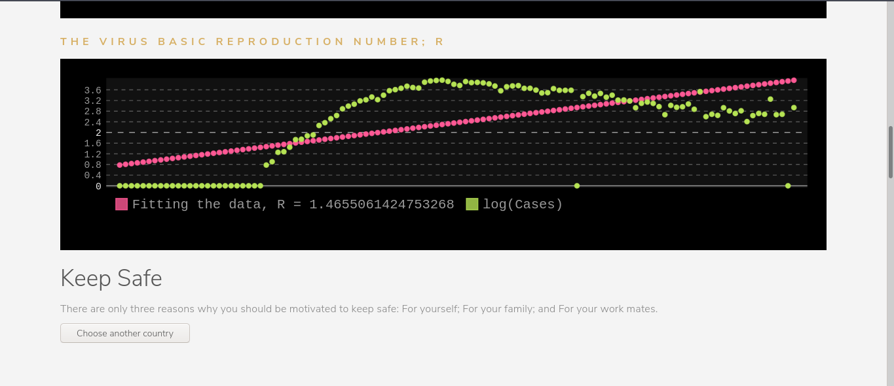

Author: Muhammad Mourad & Sayed Omar  
License: MIT License

---

# COVID19-Monitor
A simple dashboard for monitoring COVID-19 using Flask framework

### The following are the screenshots of the Dashboard:
Home Page

World Map

General Statistics

Spain Country

Japan Country

Top Deaths

